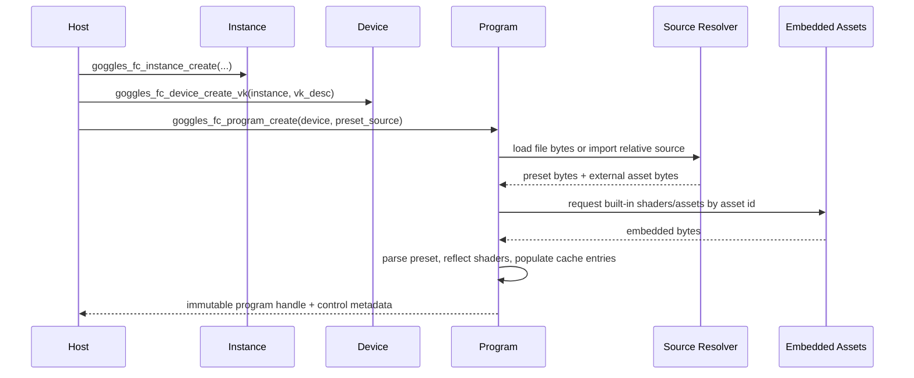
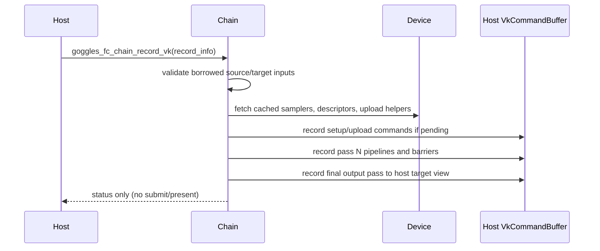

# Design: Standalone Filter-Chain API

## Technical Approach

Rebuild `filter-chain/` around a package-first runtime boundary whose public surface is a C-first
ABI with an optional thin C++ wrapper. The new boundary splits responsibilities into four owned
object families:

- `instance` owns process-local library policy such as log routing and immutable global options.
- `device` owns borrowed Vulkan device/queue bindings plus library-owned caches, upload/setup
  command resources, and device-scoped services.
- `program` owns preset parsing, source resolution, shader compilation/reflection, and immutable
  preset metadata derived from either file or memory sources.
- `chain` owns executable runtime state for one program on one device: pipelines, descriptors,
  intermediate images, control state, frame history, and record-time validation.

The existing `ChainRuntime`/`goggles_chain_*` model stays only as implementation source material
until replacement work is complete. The shipped end state removes that legacy public surface,
associated compatibility notes, and any build/install/export/docs/examples that preserve it. Public
Goggles-facing abstractions move out of `src/render/backend/` and into a dedicated adapter that
consumes the standalone API exactly like any external host. Internal shaders/assets currently
resolved through `shader_dir` become embedded library resources selected by internal asset IDs.

This design intentionally does not preserve source or ABI compatibility with the current public
surface.

Completion of this design means the repository no longer ships two public stories for filter-chain:
the installed package, public examples, public tests, and package metadata all describe only the
`goggles_fc_*` C-first contract plus the thin wrapper layered on top of it.

## Architecture Decisions

### Decision: Replace the monolithic runtime handle with explicit instance/device/program/chain objects

**Choice**: Introduce opaque C handles `goggles_fc_instance_t`, `goggles_fc_device_t`,
`goggles_fc_program_t`, and `goggles_fc_chain_t`, with creation/destruction APIs and explicit
dependency ordering.

**Alternatives considered**: Keep one `goggles_chain_t` runtime handle; split only internally while
retaining the existing public lifecycle.

**Rationale**: The proposal requires a clean-slate reusable library boundary. Separate objects make
borrowed-vs-owned resources explicit, let Goggles preload/compile programs asynchronously, and keep
record-time hot paths isolated from preset parsing and compilation work.

### Decision: Make the C ABI authoritative and keep C++ as a thin wrapper only

**Choice**: Define the full public contract in `filter-chain/include/goggles_filter_chain.h` with
`goggles_fc_*` functions and `GOGGLES_FC_*` macros. Rebuild the C++ wrapper as a header-level RAII
consumer in `namespace goggles::filter_chain` over that C ABI.

**Alternatives considered**: Continue treating the C++ wrapper as the primary API; keep dual public
surfaces with partially independent semantics.

**Rationale**: A C-first surface is the easiest contract to package, bind from other languages, and
keep ABI-focused. A thin wrapper avoids duplicated behavior and keeps all ownership rules defined in
one place.

### Decision: Bind Vulkan at the device object and remove public `shader_dir` and host command-pool inputs

**Choice**: `goggles_fc_device_create_vk(...)` accepts borrowed `VkPhysicalDevice`, `VkDevice`,
`VkQueue`, and queue-family index. The library creates and owns its internal upload/setup command
pools, transient buffers, caches, and synchronization helpers. Public create APIs no longer accept
`shader_dir` or host-owned command pools.

**Alternatives considered**: Keep the current create-time `shader_dir` contract; keep requiring a
boundary-owned `vk::CommandPool`; make the host allocate upload helpers.

**Rationale**: The host/library split in the proposal says the host provides device/queue handles
and per-record inputs while the library owns reusable runtime machinery. Removing `shader_dir`
eliminates repository-relative asset assumptions and makes installed-package behavior predictable.

### Decision: Represent presets as immutable programs loaded from file or memory sources

**Choice**: Add `goggles_fc_preset_source_t` with `file` and `memory` variants. Program creation
parses and compiles a preset source into immutable metadata plus device-scoped compiled artifacts.
Memory-backed sources optionally use a host-supplied import callback for relative includes/textures
or an explicit filesystem base path when the host wants default file-backed relative resolution.

**Alternatives considered**: Keep preset loading as a mutable chain operation only; support memory
 only for top-level preset text with no relative resolution; store only file paths publicly.

**Rationale**: A standalone library needs reusable precompiled state and testable source loading.
Separating `program` from `chain` lets Goggles compile/reload without mutating the active runtime
and makes file-vs-memory sourcing a program concern instead of a frame concern.

Canonical public UTF-8/path fields use pointer-plus-byte-length pairs. File-backed program sources
derive provenance and relative-resolution base paths from the parent directory of the supplied path.
Memory-backed program sources carry memory provenance plus optional `source_name` metadata and MUST
use either registered import callbacks or an explicit `base_path` for relative include/texture
resolution. If neither is provided, any relative external reference is rejected during program
creation instead of consulting ambient process state.

### Decision: Route all logs and diagnostics through host-owned callbacks instead of shared globals

**Choice**: Replace `filter-chain/src/support/logging.*` global logger access with an instance-owned
log router. Hosts register callbacks/sinks through the instance, and diagnostic sessions on chains
reuse the same routing infrastructure for structured events.

**Alternatives considered**: Keep `spdlog` globals and hide them behind exported functions; keep
diagnostic callbacks only for forensic mode while normal logs use library-global sinks.

**Rationale**: Shared/global logger symbols are exactly the packaging problem called out in the
proposal. Instance-owned routing keeps the library embeddable in hosts with different logging
systems and avoids symbol collisions across static/shared consumption modes.

Callback registration is replaceable at runtime through `goggles_fc_instance_set_log_callback(...)`.
The instance borrows the callback function pointer and `user_data` until the next replacement or
instance destruction. Delivery occurs synchronously on the thread that emits the log event; v1 does
not spawn a dedicated logging thread or promise cross-thread serialization beyond the API's normal
external-synchronization rules. Unstructured callback payloads provide human-readable log lines,
while structured report queries remain available on `program` and `chain` objects for machine-
readable diagnostics and last-error inspection.

### Decision: Keep programs device-affine but shareable across multiple chains on that device

**Choice**: `goggles_fc_program_t` is created against exactly one `goggles_fc_device_t` and carries
that device affinity for its full lifetime. A single program handle MAY be bound to multiple chains
created from the same device, but it MUST NOT be attached to chains on any other device.

**Alternatives considered**: Make programs instance-scoped and lazily specialize on first chain use;
require one program per chain.

**Rationale**: Device affinity keeps compiled artifacts and reflection caches concrete for Vulkan-only
v1, while multi-chain sharing allows cheap creation of multiple executable chains with independent
runtime state from one immutable preset/program.

### Decision: Keep package identity stable while changing API naming

**Choice**: Preserve the package target name `goggles-filter-chain` and exported CMake namespace
`GogglesFilterChain::goggles-filter-chain`, but rename API entry points/macros/types to
`goggles_fc_*` / `GOGGLES_FC_*` and move the C++ namespace to `goggles::filter_chain`.

**Alternatives considered**: Rename the CMake target together with the API; keep old
`goggles_chain_*` naming for target-package consistency.

**Rationale**: Downstream build integration is easier if the package identity stays stable, while
the public ABI still needs a clean break from the old object model and naming.

### Decision: Remove legacy public surface and migration artifacts at cutover

**Choice**: Treat the old public C header shape, legacy wrapper header/namespace, compatibility
examples, obsolete contract tests, stale install/export wiring, and package metadata that mentions
removed runtime assumptions as temporary migration scaffolding only. Before the change is complete,
all such artifacts must be deleted or rewritten so the shipped package presents one public contract.

**Alternatives considered**: Leave deprecated headers or docs in place for reference; keep dual
consumer examples; preserve old install metadata as a compatibility convenience.

**Rationale**: The proposal defines a clean-slate redesign. Leaving deprecated surfaces, shims, or
stale docs/examples behind would keep the migration ambiguous and continue exporting the old
contract in practice even if the new API exists.

## Data Flow

### High-Level Ownership

```text
Host Process
    |
    +--> goggles_fc_instance
    |        \-- log router, global options
    |
    +--> goggles_fc_device
    |        \-- borrowed VkDevice/VkQueue
    |        \-- owned caches, command pools, upload helpers
    |
    +--> goggles_fc_program
    |        \-- parsed preset graph
    |        \-- compiled shaders/reflection
    |        \-- embedded built-in asset references
    |
    \--> goggles_fc_chain
             \-- pipelines, descriptors, framebuffers, controls, history
             \-- records into host command buffer using host-provided images/views
```

### Program Build Sequence



### Record-Time Sequence



### Goggles Integration Flow

```text
src/render/backend/vulkan_backend.cpp
    -> src/render/backend/filter_chain_controller.cpp
        -> goggles_fc_instance / goggles_fc_device / goggles_fc_program / goggles_fc_chain
            -> filter-chain runtime internals

Host owns:
- swapchain lifecycle
- external image import
- queue submit / present
- async reload scheduling

Library owns:
- preset parsing and include resolution
- shader compilation and reflection cache
- internal pipelines and framebuffers
- built-in shader assets
- diagnostics fanout
```

## File Changes

| File | Action | Description |
|------|--------|-------------|
| `filter-chain/include/goggles_filter_chain.h` | Modify | Replace the current `goggles_chain_*` ABI with the new `goggles_fc_*` object model, status types, source descriptors, logging callbacks, and Vulkan create/record structs. |
| `filter-chain/include/goggles_filter_chain.hpp` | Delete | Remove the current `goggles::render::FilterChainRuntime` wrapper so the old API shape cannot leak forward. |
| `filter-chain/include/goggles/filter_chain.hpp` | Create | Define the canonical thin C++ wrapper entrypoint in `namespace goggles::filter_chain` over the C ABI. |
| `filter-chain/include/goggles/filter_chain/common.hpp` | Create | Hold public C++ enums and POD wrapper types shared by the wrapper surface. |
| `filter-chain/src/api/c_api.cpp` | Create | Implement handle validation, ABI marshaling, status mapping, and the exported `goggles_fc_*` functions. |
| `filter-chain/src/api/cpp_wrapper.cpp` | Create | Implement the thin RAII C++ wrapper using only the C ABI. |
| `filter-chain/src/api/abi_validation.hpp` | Create | Centralize struct-size/version validation and borrowed-handle checks for the C layer. |
| `filter-chain/src/runtime/instance.hpp` | Create | Define the internal instance object, callback registry, and log router ownership. |
| `filter-chain/src/runtime/instance.cpp` | Create | Implement instance lifecycle and callback dispatch rules. |
| `filter-chain/src/runtime/device.hpp` | Create | Define device-scoped caches, internal command resources, and Vulkan borrowed-handle storage. |
| `filter-chain/src/runtime/device.cpp` | Create | Implement device creation, cache initialization, and teardown in dependency order. |
| `filter-chain/src/runtime/program.hpp` | Create | Define immutable compiled preset/program state and source provenance. |
| `filter-chain/src/runtime/program.cpp` | Create | Implement file/memory preset loading, include resolution, built-in asset lookup, and compilation. |
| `filter-chain/src/runtime/chain.hpp` | Create | Define executable chain state bound to one device/program pair. |
| `filter-chain/src/runtime/chain.cpp` | Create | Implement output retargeting, resize, controls, and record-time execution. |
| `filter-chain/src/runtime/source_resolver.hpp` | Create | Define file and memory source resolution contracts for presets, includes, and textures. |
| `filter-chain/src/runtime/source_resolver.cpp` | Create | Implement path-based and callback-based source resolution with provenance tracking. |
| `filter-chain/src/runtime/embedded_assets.cpp` | Create | Register compiled-in built-in shaders/assets and expose lookup by internal asset id. |
| `filter-chain/src/support/logging.hpp` | Modify | Replace global logger getters/setters with internal log-router primitives only. |
| `filter-chain/src/support/logging.cpp` | Modify | Remove `spdlog::set_default_logger(...)` style global ownership and route through instance-bound sinks. |
| `filter-chain/src/chain/chain_runtime.hpp` | Modify | Retain only lower-level reusable execution helpers or migrate declarations into the new runtime layer. |
| `filter-chain/src/chain/chain_runtime.cpp` | Modify | Re-scope existing runtime internals behind `device/program/chain` objects instead of a public monolith. |
| `filter-chain/src/chain/preset_parser.hpp` | Modify | Generalize parser inputs away from filesystem-only loading so program creation can use file or memory sources. |
| `filter-chain/src/chain/preset_parser.cpp` | Modify | Implement parser integration with the new source resolver and provenance model. |
| `filter-chain/CMakeLists.txt` | Modify | Reorganize build targets around `api`, `runtime`, and embedded-assets sources; remove install-time dependency on public asset directories for built-ins. |
| `filter-chain/cmake/GogglesFilterChainConfig.cmake.in` | Modify | Stop exporting runtime asset-dir assumptions and keep package metadata focused on headers, library targets, and private dependency discovery. |
| `filter-chain/tests/contract/test_filter_chain_c_api_contracts.cpp` | Modify | Rewrite coverage for `goggles_fc_*`, object lifecycle splits, memory/file preset sources, and log callback contracts. |
| `filter-chain/tests/consumer/static/main.cpp` | Modify | Validate the installed C++ wrapper surface under the new namespace and header layout. |
| `filter-chain/tests/consumer/shared/main.cpp` | Modify | Validate shared-library consumption through the new wrapper surface. |
| public docs/examples/install checks | Modify | Remove or rewrite any example, package note, or usage snippet that references removed names, wrapper layouts, or `shader_dir`-style assumptions. |
| `src/render/backend/filter_chain_adapter.hpp` | Delete | Remove the intermediate Goggles-side adapter after its responsibilities move into the controller-owned consumer boundary. |
| `src/render/backend/filter_chain_adapter.cpp` | Delete | Remove the intermediate Goggles-side adapter implementation after controller consolidation. |
| `src/render/backend/filter_chain_controller.hpp` | Modify | Replace direct `FilterChainRuntime` ownership with controller-owned standalone instance/device/program/chain handles and controller-local boundary types. |
| `src/render/backend/filter_chain_controller.cpp` | Modify | Move reload, retarget, control, diagnostics, and standalone object-graph ownership into the controller instead of a separate adapter layer. |
| `src/render/backend/vulkan_backend.cpp` | Modify | Build controller/device descriptors and keep host responsibilities restricted to swapchain, import, submission, and presentation. |

## Interfaces / Contracts

### Public C ABI Shape

```c
typedef struct goggles_fc_instance goggles_fc_instance_t;
typedef struct goggles_fc_device goggles_fc_device_t;
typedef struct goggles_fc_program goggles_fc_program_t;
typedef struct goggles_fc_chain goggles_fc_chain_t;

typedef uint32_t goggles_fc_status_t;
typedef uint32_t goggles_fc_log_level_t;
typedef uint32_t goggles_fc_capability_flags_t;
typedef uint32_t goggles_fc_preset_source_kind_t;

typedef struct GogglesFcUtf8View {
    const char* data;
    size_t size;
} goggles_fc_utf8_view_t;

typedef struct GogglesFcLogMessage {
    uint32_t struct_size;
    goggles_fc_log_level_t level;
    goggles_fc_utf8_view_t domain;
    goggles_fc_utf8_view_t message;
} goggles_fc_log_message_t;

typedef void(GOGGLES_FC_CALL* goggles_fc_log_callback_t)(
    const goggles_fc_log_message_t* message,
    void* user_data);

typedef struct GogglesFcInstanceCreateInfo {
    uint32_t struct_size;
    goggles_fc_log_callback_t log_callback;
    void* log_user_data;
} goggles_fc_instance_create_info_t;

typedef struct GogglesFcVkDeviceCreateInfo {
    uint32_t struct_size;
    VkPhysicalDevice physical_device;
    VkDevice device;
    VkQueue graphics_queue;
    uint32_t graphics_queue_family_index;
    goggles_fc_utf8_view_t cache_dir; /* optional */
} goggles_fc_vk_device_create_info_t;

typedef struct GogglesFcPresetSource {
    uint32_t struct_size;
    goggles_fc_preset_source_kind_t kind;
    goggles_fc_utf8_view_t source_name;
    const void* bytes;
    size_t byte_count;
    goggles_fc_utf8_view_t path;
    goggles_fc_utf8_view_t base_path;
    const goggles_fc_import_callbacks_t* import_callbacks; /* optional for memory */
} goggles_fc_preset_source_t;

typedef struct GogglesFcChainCreateInfo {
    uint32_t struct_size;
    VkFormat target_format;
    uint32_t frames_in_flight;
    uint32_t initial_stage_mask;
    GogglesFcExtent2D initial_prechain_resolution;
} goggles_fc_chain_create_info_t;

typedef struct GogglesFcRecordInfoVk {
    uint32_t struct_size;
    VkCommandBuffer command_buffer;
    VkImage source_image;
    VkImageView source_view;
    GogglesFcExtent2D source_extent;
    VkImageView target_view;
    GogglesFcExtent2D target_extent;
    uint32_t frame_index;
    uint32_t scale_mode;
    uint32_t integer_scale;
} goggles_fc_record_info_vk_t;

goggles_fc_status_t goggles_fc_instance_create(
    const goggles_fc_instance_create_info_t* create_info,
    goggles_fc_instance_t** out_instance);
void goggles_fc_instance_destroy(goggles_fc_instance_t* instance);

uint32_t goggles_fc_get_api_version(void);
uint32_t goggles_fc_get_abi_version(void);
goggles_fc_capability_flags_t goggles_fc_get_capabilities(void);

goggles_fc_status_t goggles_fc_instance_set_log_callback(
    goggles_fc_instance_t* instance,
    goggles_fc_log_callback_t log_callback,
    void* user_data);

goggles_fc_status_t goggles_fc_device_create_vk(
    goggles_fc_instance_t* instance,
    const goggles_fc_vk_device_create_info_t* create_info,
    goggles_fc_device_t** out_device);
void goggles_fc_device_destroy(goggles_fc_device_t* device);

goggles_fc_status_t goggles_fc_program_create(
    goggles_fc_device_t* device,
    const goggles_fc_preset_source_t* source,
    goggles_fc_program_t** out_program);
void goggles_fc_program_destroy(goggles_fc_program_t* program);

goggles_fc_status_t goggles_fc_program_get_source_info(
    const goggles_fc_program_t* program,
    goggles_fc_program_source_info_t* out_source_info);

goggles_fc_status_t goggles_fc_program_get_report(
    const goggles_fc_program_t* program,
    goggles_fc_program_report_t* out_report);

goggles_fc_status_t goggles_fc_chain_create(
    goggles_fc_device_t* device,
    const goggles_fc_program_t* program,
    const goggles_fc_chain_create_info_t* create_info,
    goggles_fc_chain_t** out_chain);
void goggles_fc_chain_destroy(goggles_fc_chain_t* chain);

goggles_fc_status_t goggles_fc_chain_bind_program(
    goggles_fc_chain_t* chain,
    const goggles_fc_program_t* program);

goggles_fc_status_t goggles_fc_chain_clear(goggles_fc_chain_t* chain);

goggles_fc_status_t goggles_fc_chain_resize(
    goggles_fc_chain_t* chain,
    const goggles_fc_extent_2d_t* new_source_extent);

goggles_fc_status_t goggles_fc_chain_retarget(
    goggles_fc_chain_t* chain,
    const goggles_fc_chain_target_info_t* target_info);

goggles_fc_status_t goggles_fc_chain_record_vk(
    goggles_fc_chain_t* chain,
    const goggles_fc_record_info_vk_t* record_info);

goggles_fc_status_t goggles_fc_chain_get_report(
    const goggles_fc_chain_t* chain,
    goggles_fc_chain_report_t* out_report);

goggles_fc_status_t goggles_fc_chain_get_last_error(
    const goggles_fc_chain_t* chain,
    goggles_fc_chain_error_info_t* out_error);

goggles_fc_status_t goggles_fc_chain_get_control_count(
    const goggles_fc_chain_t* chain,
    uint32_t* out_count);

goggles_fc_status_t goggles_fc_chain_get_control_info(
    const goggles_fc_chain_t* chain,
    uint32_t index,
    goggles_fc_control_info_t* out_control);

goggles_fc_status_t goggles_fc_chain_set_control_value_f32(
    goggles_fc_chain_t* chain,
    uint32_t index,
    float value);

const char* goggles_fc_status_string(goggles_fc_status_t status);
bool goggles_fc_is_success(goggles_fc_status_t status);
bool goggles_fc_is_error(goggles_fc_status_t status);
```

### Internal Module Boundaries

```text
filter-chain/include/
    public ABI and C++ wrapper only

filter-chain/src/api/
    exported function entrypoints
    ABI validation and status mapping

filter-chain/src/runtime/
    instance/device/program/chain ownership
    source resolution
    embedded asset registry

filter-chain/src/chain/
    reusable pass graph, executor, resources, controls

filter-chain/src/shader/
    shader runtime, preprocessing, reflection

filter-chain/src/diagnostics/
    structured diagnostic events and sinks

src/render/backend/
    Goggles-only adapter and host lifecycle coordination
```

### Ownership Rules

- `instance`, `device`, `program`, and `chain` are library-owned opaque handles destroyed by their
  matching `*_destroy(...)` functions.
- `goggles_fc_program_t` is affine to the `goggles_fc_device_t` used at creation and MAY be shared by
  multiple chains created from that same device.
- `VkPhysicalDevice`, `VkDevice`, and `VkQueue` passed into `device_create_vk` are borrowed and
  MUST outlive every chain/program/device derived from that device.
- `VkCommandBuffer`, `VkImage`, and `VkImageView` passed into `chain_record_vk` are borrowed for the
  duration of the call only.
- Preset source bytes passed as `memory` are copied or fully consumed during program creation; the
  library MUST NOT retain caller memory after create returns.
- Log callback pointers are registered on the instance and remain borrowed until replaced or the
  instance is destroyed.

Destroy ordering is strict: chains MUST be destroyed before their bound program or device, programs
MUST be destroyed before their device, and devices MUST be destroyed before their instance. Each
`*_destroy(...)` function accepts `NULL` and treats it as a no-op. Re-destroying a non-`NULL` handle
after successful destruction is invalid caller behavior; v1 guarantees null-safe destroy, not handle
idempotence for stale pointers.

### Threading and Synchronization Rules

- The public C API is externally synchronized by default. Hosts MUST NOT call mutating operations on
  the same `instance`, `device`, `program`, or `chain` concurrently unless a specific API is later
  documented as concurrent-safe.
- Distinct handles MAY be used concurrently when they do not share the same object instance and the
  host still satisfies borrowed Vulkan object synchronization requirements.
- `goggles_fc_chain_record_vk(...)`, resize/retarget operations, control mutation, and callback
  replacement are all mutating operations and therefore require host-side serialization per object.
- Query-style helpers such as version/capability inspection and status-string lookup are process-
  global pure reads and may be called concurrently.
- Log callbacks execute on the same thread that triggered the underlying event; hosts MUST keep the
  callback non-blocking enough to avoid stalling the calling API unexpectedly.

## Testing Strategy

| Layer | What to Test | Approach |
|-------|-------------|----------|
| Unit | Struct validation, UTF-8/source validation, log-router dispatch, source-resolver rules | Extend `filter-chain/tests/contract/` with focused tests that avoid live Vulkan where possible. |
| Unit | Program creation from file and memory, built-in asset lookup, relative include resolution | Add parser/program tests that use library-owned fixture bytes and callback-backed memory imports. |
| Integration | Vulkan device/program/chain lifecycle, retargeting, controls, diagnostics, record validation | Rewrite `filter-chain/tests/contract/test_filter_chain_c_api_contracts.cpp` around `goggles_fc_*` and Vulkan-backed happy/validation paths. |
| Integration | Installed static/shared package consumption | Keep `filter-chain/tests/consumer/static/` and `filter-chain/tests/consumer/shared/`, updated to compile against the new wrapper/public headers only. |
| Integration | Legacy-surface absence | Add negative checks or install-tree inspection proving removed headers, deprecated aliases, old examples, and stale package metadata are not shipped. |
| Integration | Goggles controller boundary | Add backend tests under `tests/render/` that verify Goggles uses the standalone controller-owned consumer boundary rather than direct library internals. |
| E2E | Goggles preset reload, swapchain retarget, and control persistence | Reuse existing backend/manual coverage through `pixi run test -p test` and relevant render integration tests once the controller-owned consumer boundary is wired. |

## Migration / Rollout

This change rolls out as a single incompatible API transition on the change branch.

1. Introduce the new internal runtime objects (`instance`, `device`, `program`, `chain`) and the
   Goggles-side consumer boundary while reusing lower-level chain/shader modules where practical.
2. Replace the public C header and C++ wrapper in one pass; do not ship public compatibility
   aliases for `goggles_chain_*`, `GOGGLES_CHAIN_*`, or `FilterChainRuntime`.
3. Switch Goggles backend code to `src/render/backend/filter_chain_controller.*` so no Goggles
   module outside the render/backend controller boundary knows the library internals.
4. Rewrite contract and consumer tests against the new installed surface.
5. Remove public asset-dir packaging assumptions after embedded built-ins and testdata coverage are
   in place.
6. Delete or rewrite obsolete public docs/examples, install/export wiring, package metadata, and
   validation paths so the installed package exposes only the final standalone contract.

No feature flag or runtime migration path is required because backward compatibility is explicitly
out of scope.

## Open Questions

- [x] Decide whether installed file-source contract fixtures should live under
      `share/goggles-filter-chain/testdata` or be generated entirely by the test harness.

### Resolved: Test harness generates validation fixtures at build/test time

Installed file-source contract fixtures SHALL NOT ship under `share/goggles-filter-chain/testdata`.
Instead, contract and consumer tests SHALL generate minimal fixture presets (for example trivial
`.slangp` files) at CMake configure or CTest time within the build tree. Memory-source tests use
in-process byte buffers directly. This avoids adding public packaging surface area for test content
and keeps the installed package focused on headers, library targets, and embedded runtime assets.
